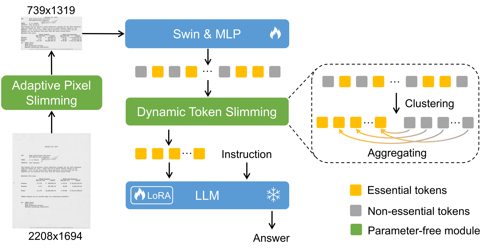
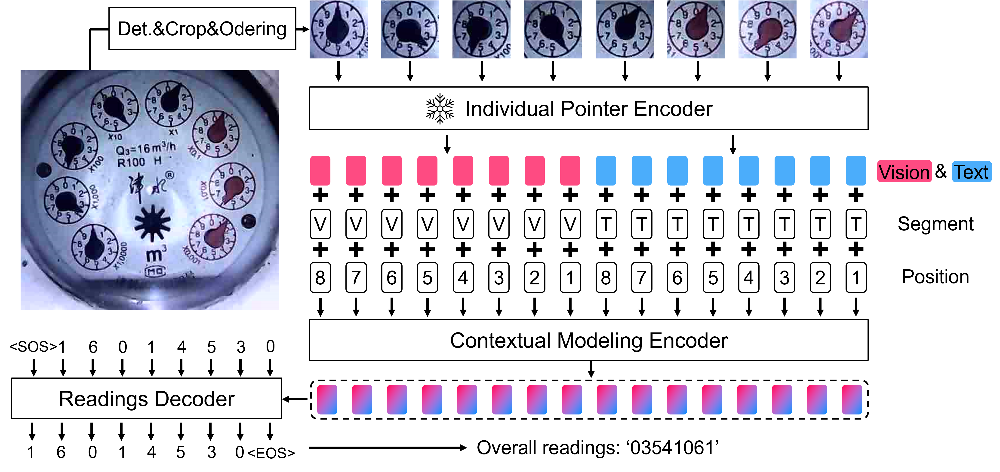
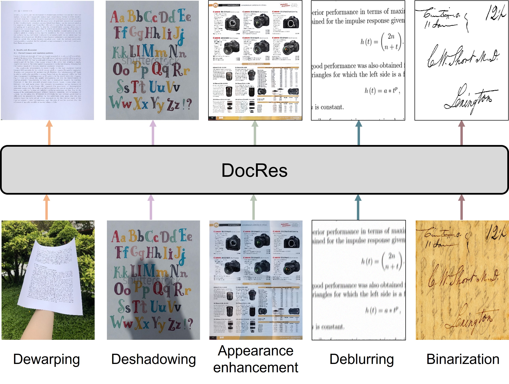

-----

### DocKylin: A Large Multimodal Model for Visual Document Understanding with Efficient Visual Slimming

<strong><u>Jiaxin Zhang</u></strong>, Wentao Yang, Songxuan Lai, Zecheng Xie, Lianwen Jin* 
AAAI, 2025 

 

-----

### Towards Accurate Readings of Water Meters by Eliminating Transition Error: New Dataset and Effective Solution

<strong><u>Jiaxin Zhang</u></strong>, Daizhen Jia, Chongyu Liu, Dezhi Peng, Bangdong Chen, Xue Gao and Lianwen Jin* 
TIM, 2025 

 

-----

### DocRes: A Generalist Model Toward Unifying Document Image Restoration Tasks

<strong><u>Jiaxin Zhang</u></strong>, Dezhi Peng, Chongyu Liu, Peirong Zhang, Lianwen Jin* 
CVPR, 2024 

 

